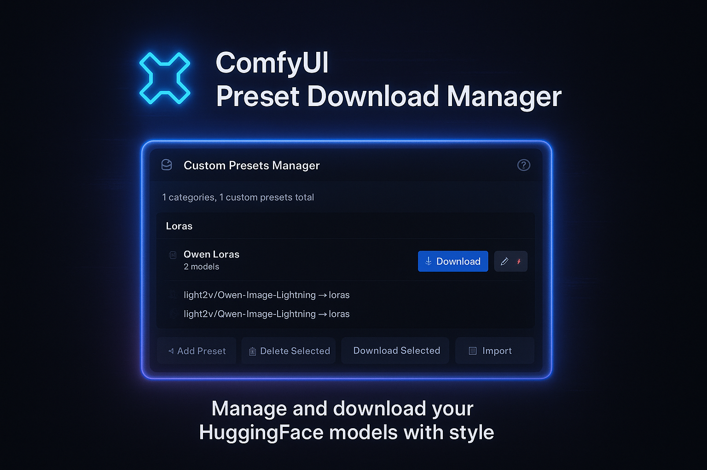

# ComfyUI Preset Download Manager



A custom ComfyUI node that allows you to manage and download models from HuggingFace with a convenient preset system.

## Features

- 🎯 **Preset Management**: Create and manage presets containing multiple models
- 🔗 **Direct URL Download**: Download models directly by URL (default option)
- 🤗 **HuggingFace Integration**: Support for HuggingFace Model ID with optional Model Path
- ⚡ **Smart Download**: Automatically skips already downloaded files
- 🎨 **Modern UI**: Beautiful dark-themed interface with modal windows
- 💾 **JSON Storage**: Presets are saved in JSON format for easy backup and sharing
- 🔑 **Private Models**: Support for HuggingFace API tokens for private/gated models
- 📁 **Custom Folders**: Save models to custom folders or standard ComfyUI directories
- 🌐 **Multi-language**: Help available in English and Russian

## Installation

1. Copy this folder to your ComfyUI `custom_nodes` directory:
   ```
   ComfyUI/custom_nodes/ComfyUI-PresetDownloadManager/
   ```

2. Install dependencies:
   ```bash
   pip install -r requirements.txt
   ```

3. Restart ComfyUI

## Usage

### Opening the Manager

1. Add the **"HF Preset Download Manager"** node to your workflow (category: `utils`)
2. Click the **"⚙ Open Manager"** button on the node to open the preset manager interface

### Creating a Preset

1. Click **"➕ Add Preset"** in the manager
2. Enter a **Preset Name** (required)
3. Optionally add a **Category** for organization
4. Add one or more models to the preset:
   - **Direct URL** (default, required): Direct download link to the model file
     - Example: `https://huggingface.co/user/model/resolve/main/file.safetensors`
     - This is the default option - just paste the direct URL
   - **☐ Use HuggingFace Repository** (checkbox): Enable to use HuggingFace Model ID instead
     - When checked, you'll see:
       - **HuggingFace Model ID** (required): Format `username/model-name`
         - Example: `runwayml/stable-diffusion-v1-5`
       - **Model Path** (optional): Specific file path within the repository
         - Example: `model.safetensors` or `vae/vae.safetensors`
         - Leave empty to download the entire repository
   - **Save to Folder** (required): Choose where to save the model
     - Standard folders: `checkpoints`, `loras`, `vae`, `upscale_models`, etc.
     - Or select "Custom folder..." to specify a custom path
   - **HuggingFace API Token** (optional): Required for private/gated models
     - Get your token from [HuggingFace Settings → Access Tokens](https://huggingface.co/settings/tokens)
5. Click **"Save Preset"**

### Downloading Models

- **Single Preset**: Click **"⬇️ Download"** on any preset card
- **Multiple Presets**: 
  1. Select presets using checkboxes
  2. Click **"⬇️ Download Selected"** in the footer

### Editing Presets

- Click the **✏️ Edit** button on any preset card
- Modify the preset details and models
- Click **"Update Preset"** to save changes

### Other Features

- **📋 Edit JSON**: Direct JSON editing of all presets
- **📥 Import/Export**: Import or export presets as JSON files
- **🗑️ Delete**: Remove individual presets or multiple selected presets
- **❓ Help**: Click the **"?"** button in the header for detailed instructions

### Example Presets File

You can import presets from a JSON file. See `custom-presets.json` in the repository for an example format:

```json
{
  "categories": [],
  "presets": [
    {
      "id": "preset-1",
      "name": "My Preset",
      "category": "Custom",
      "models": [
        {
          "direct_url": "https://huggingface.co/user/model/resolve/main/file.safetensors",
          "save_path": "checkpoints",
          "hf_token": ""
        }
      ]
    },
    {
      "id": "preset-2",
      "name": "HuggingFace Preset",
      "category": "Custom",
      "models": [
        {
          "model_id": "username/model-name",
          "model_path": "model.safetensors",
          "save_path": "checkpoints",
          "hf_token": ""
        }
      ]
    }
  ]
}
```

To import:
1. Click **"📥 Import"** in the manager
2. Select your JSON file
3. Your presets will be merged with existing ones

## Field Descriptions

### Direct URL (Default)
The direct download link to the model file. This is the default and recommended method for downloading models.

**How to get a Direct URL:**
1. Go to the model page on [huggingface.co](https://huggingface.co)
2. Navigate to the file you want to download
3. Click on the file name
4. Click the "Download" button or right-click and "Copy link address"
5. The URL should look like: `https://huggingface.co/user/model/resolve/main/file.safetensors`

**Examples:**
- `https://huggingface.co/runwayml/stable-diffusion-v1-5/resolve/main/v1-5-pruned.safetensors`
- `https://huggingface.co/stabilityai/stable-diffusion-xl-base-1.0/resolve/main/sd_xl_base_1.0.safetensors`

### Use HuggingFace Repository (Checkbox)
Enable this checkbox to use HuggingFace Model ID instead of Direct URL. When enabled, you'll see additional fields for HuggingFace Model ID and Model Path.

### HuggingFace Model ID
The model identifier on HuggingFace in the format `username/model-name`. You can find this on the model's page at [huggingface.co](https://huggingface.co) - it's the path in the URL after the domain.

**Examples:**
- `runwayml/stable-diffusion-v1-5`
- `stabilityai/stable-diffusion-xl-base-1.0`
- `lightx2v/Qwen-Image-Lightning`

### Model Path (Optional)
Path to a specific file within the model repository. Leave empty if you want to download the entire model.

**Examples:**
- `model.safetensors` - to download a single file
- `vae/vae.safetensors` - for a file in a subfolder
- **Empty** - download the entire model (all files from the repository)

### Save to Folder
The folder in ComfyUI where the model will be saved. Select the model type from the list or choose "Custom folder..." to specify a custom path.

**Available standard folders:**
- `checkpoints` - for main models (Stable Diffusion, etc.)
- `loras` - for LoRA models
- `vae` - for VAE models
- `upscale_models` - for upscale models
- And other model types...

### HuggingFace API Token (Optional)
Some models on HuggingFace require authorization (private/gated models). For such models, you need to specify an API key.

**How to get an API key:**
1. Register on [huggingface.co](https://huggingface.co)
2. Go to [Settings → Access Tokens](https://huggingface.co/settings/tokens)
3. Create a new token (read access is sufficient)
4. Copy the token (starts with `hf_`)

For public models, an API key is not required - leave the field empty.

### Presets
A preset is a group of models that can be downloaded together with one click. You can add multiple models to one preset, use categories to organize presets, and edit presets using the ✏️ button.

## Tips & Tricks

- **Direct URL is the default** - just paste the download link, no need to enable HuggingFace Repository unless you need it
- Files are **automatically checked** before download - existing files are skipped to save time and bandwidth
- When using Model Path, files are saved **directly to the selected folder** without creating subdirectories
- You can add multiple models to one preset
- Use categories to organize presets
- Edit presets using the ✏️ button
- Select multiple presets and download them all at once
- On timeout, the download will automatically resume on the next attempt
- Use proxy or mirrors if access to HuggingFace is restricted
- For private models, specify the HuggingFace API Token
- **Presets are saved automatically** in `presets.json` and persist after ComfyUI restart

## Troubleshooting

### Download Timeouts

If you experience timeouts during download, the system will automatically retry up to 5 times. If problems persist:

1. **Use a proxy** (if HuggingFace access is restricted):
   ```bash
   export HTTPS_PROXY=http://your-proxy:port
   ```

2. **Use a HuggingFace mirror**:
   ```bash
   export HF_ENDPOINT=https://hf-mirror.com
   ```

3. **Try downloading again** - downloads automatically resume from where they stopped

### Button Not Appearing

If the "Open Manager" button doesn't appear after adding the node:
- Refresh the page (F5)
- Check the browser console (F12) for any errors

---

# ComfyUI Preset Download Manager (Русский)

Кастомная нода для ComfyUI, позволяющая управлять и загружать модели из HuggingFace с удобной системой пресетов.

## Возможности

- 🎯 **Управление пресетами**: Создавайте и управляйте пресетами, содержащими несколько моделей
- 🔗 **Прямая ссылка**: Загрузка моделей по прямой ссылке (по умолчанию)
- 🤗 **Интеграция с HuggingFace**: Поддержка HuggingFace Model ID с опциональным Model Path
- ⚡ **Умная загрузка**: Автоматически пропускает уже загруженные файлы
- 🎨 **Современный UI**: Красивый интерфейс с темной темой и модальными окнами
- 💾 **Хранение в JSON**: Пресеты сохраняются в формате JSON для удобного резервного копирования и обмена
- 🔑 **Приватные модели**: Поддержка API токенов HuggingFace для приватных/ограниченных моделей
- 📁 **Кастомные папки**: Сохранение моделей в кастомные папки или стандартные директории ComfyUI
- 🌐 **Многоязычность**: Справка доступна на английском и русском языках

## Установка

1. Скопируйте эту папку в директорию `custom_nodes` вашей установки ComfyUI:
   ```
   ComfyUI/custom_nodes/ComfyUI-PresetDownloadManager/
   ```

2. Установите зависимости:
   ```bash
   pip install -r requirements.txt
   ```

3. Перезапустите ComfyUI

## Использование

### Открытие менеджера

1. Добавьте ноду **"HF Preset Download Manager"** в ваш workflow (категория: `utils`)
2. Нажмите кнопку **"⚙ Open Manager"** на ноде, чтобы открыть интерфейс менеджера пресетов

### Создание пресета

1. Нажмите **"➕ Add Preset"** в менеджере
2. Введите **Preset Name** (обязательно)
3. Опционально добавьте **Category** для организации
4. Добавьте одну или несколько моделей в пресет:
   - **Direct URL** (по умолчанию, обязательно): Прямая ссылка для скачивания файла модели
     - Пример: `https://huggingface.co/user/model/resolve/main/file.safetensors`
     - Это опция по умолчанию - просто вставьте прямую ссылку
   - **☐ Use HuggingFace Repository** (чекбокс): Включите для использования HuggingFace Model ID
     - При включении появятся поля:
       - **HuggingFace Model ID** (обязательно): Формат `username/model-name`
         - Пример: `runwayml/stable-diffusion-v1-5`
       - **Model Path** (опционально): Путь к конкретному файлу в репозитории
         - Пример: `model.safetensors` или `vae/vae.safetensors`
         - Оставьте пустым, чтобы загрузить весь репозиторий
   - **Save to Folder** (обязательно): Выберите, куда сохранить модель
     - Стандартные папки: `checkpoints`, `loras`, `vae`, `upscale_models` и т.д.
     - Или выберите "Custom folder..." для указания кастомного пути
   - **HuggingFace API Token** (опционально): Требуется для приватных/ограниченных моделей
     - Получите токен в [HuggingFace Settings → Access Tokens](https://huggingface.co/settings/tokens)
5. Нажмите **"Save Preset"**

### Загрузка моделей

- **Один пресет**: Нажмите **"⬇️ Download"** на карточке пресета
- **Несколько пресетов**: 
  1. Выберите пресеты с помощью чекбоксов
  2. Нажмите **"⬇️ Download Selected"** в футере

### Редактирование пресетов

- Нажмите кнопку **✏️ Edit** на карточке пресета
- Измените детали пресета и модели
- Нажмите **"Update Preset"** для сохранения изменений

### Другие возможности

- **📋 Edit JSON**: Прямое редактирование JSON всех пресетов
- **📥 Import/Export**: Импорт или экспорт пресетов как JSON файлы
- **🗑️ Delete**: Удаление отдельных пресетов или нескольких выбранных пресетов
- **❓ Help**: Нажмите кнопку **"?"** в заголовке для подробных инструкций

### Пример файла пресетов

Вы можете импортировать пресеты из JSON файла. Смотрите `custom-presets.json` в репозитории для примера формата:

```json
{
  "categories": [],
  "presets": [
    {
      "id": "preset-1",
      "name": "Мой пресет",
      "category": "Кастомный",
      "models": [
        {
          "direct_url": "https://huggingface.co/user/model/resolve/main/file.safetensors",
          "save_path": "checkpoints",
          "hf_token": ""
        }
      ]
    },
    {
      "id": "preset-2",
      "name": "HuggingFace пресет",
      "category": "Кастомный",
      "models": [
        {
          "model_id": "username/model-name",
          "model_path": "model.safetensors",
          "save_path": "checkpoints",
          "hf_token": ""
        }
      ]
    }
  ]
}
```

Для импорта:
1. Нажмите **"📥 Import"** в менеджере
2. Выберите ваш JSON файл
3. Ваши пресеты будут объединены с существующими

## Описание полей

### Direct URL (По умолчанию)
Прямая ссылка для скачивания файла модели. Это опция по умолчанию и рекомендуемый способ загрузки моделей.

**Как получить прямую ссылку:**
1. Перейдите на страницу модели на [huggingface.co](https://huggingface.co)
2. Перейдите к файлу, который хотите скачать
3. Нажмите на имя файла
4. Нажмите кнопку "Download" или правой кнопкой мыши "Копировать адрес ссылки"
5. URL должен выглядеть так: `https://huggingface.co/user/model/resolve/main/file.safetensors`

**Примеры:**
- `https://huggingface.co/runwayml/stable-diffusion-v1-5/resolve/main/v1-5-pruned.safetensors`
- `https://huggingface.co/stabilityai/stable-diffusion-xl-base-1.0/resolve/main/sd_xl_base_1.0.safetensors`

### Use HuggingFace Repository (Чекбокс)
Включите этот чекбокс для использования HuggingFace Model ID вместо прямой ссылки. При включении появятся дополнительные поля для HuggingFace Model ID и Model Path.

### HuggingFace Model ID
Идентификатор модели на HuggingFace в формате `username/model-name`. Вы можете найти его на странице модели на [huggingface.co](https://huggingface.co) - это путь в URL после домена.

**Примеры:**
- `runwayml/stable-diffusion-v1-5`
- `stabilityai/stable-diffusion-xl-base-1.0`
- `lightx2v/Qwen-Image-Lightning`

### Model Path (Опционально)
Путь к конкретному файлу внутри репозитория модели. Оставьте пустым, если хотите загрузить всю модель.

**Примеры:**
- `model.safetensors` - для загрузки одного файла
- `vae/vae.safetensors` - для файла в подпапке
- **Пусто** - загрузить всю модель (все файлы из репозитория)

### Save to Folder
Папка в ComfyUI, куда будет сохранена модель. Выберите тип модели из списка или выберите "Custom folder..." для указания кастомного пути.

**Доступные стандартные папки:**
- `checkpoints` - для основных моделей (Stable Diffusion и т.д.)
- `loras` - для LoRA моделей
- `vae` - для VAE моделей
- `upscale_models` - для моделей апскейла
- И другие типы моделей...

### HuggingFace API Token (Опционально)
Некоторые модели на HuggingFace требуют авторизации (private/gated models). Для таких моделей необходимо указать API ключ.

**Как получить API ключ:**
1. Зарегистрируйтесь на [huggingface.co](https://huggingface.co)
2. Перейдите в [Settings → Access Tokens](https://huggingface.co/settings/tokens)
3. Создайте новый токен (read access достаточно)
4. Скопируйте токен (начинается с `hf_`)

Для публичных моделей API ключ не требуется - оставьте поле пустым.

### Presets
Пресет - это группа моделей, которые можно загрузить вместе одним кликом. Вы можете добавить несколько моделей в один пресет, использовать категории для организации пресетов и редактировать пресеты с помощью кнопки ✏️.

## Советы и хитрости

- **Прямая ссылка по умолчанию** - просто вставьте ссылку для скачивания, не нужно включать HuggingFace Repository, если это не требуется
- Файлы **автоматически проверяются** перед загрузкой - существующие файлы пропускаются для экономии времени и трафика
- При использовании Model Path файлы сохраняются **напрямую в выбранную папку** без создания подпапок
- Вы можете добавить несколько моделей в один пресет
- Используйте категории для организации пресетов
- Редактируйте пресеты с помощью кнопки ✏️
- Выберите несколько пресетов и загрузите их все сразу
- При таймауте загрузка автоматически возобновится при следующей попытке
- Используйте прокси или зеркала, если доступ к HuggingFace ограничен
- Для приватных моделей укажите HuggingFace API Token
- **Пресеты сохраняются автоматически** в `presets.json` и сохраняются после перезапуска ComfyUI

## Решение проблем

### Таймауты при загрузке

Если вы испытываете таймауты во время загрузки, система автоматически повторит попытку до 5 раз. Если проблемы сохраняются:

1. **Используйте прокси** (если доступ к HuggingFace ограничен):
   ```bash
   export HTTPS_PROXY=http://your-proxy:port
   ```

2. **Используйте зеркало HuggingFace**:
   ```bash
   export HF_ENDPOINT=https://hf-mirror.com
   ```

3. **Попробуйте загрузить снова** - загрузка автоматически возобновится с места остановки

### Кнопка не появляется

Если кнопка "Open Manager" не появляется после добавления ноды:
- Обновите страницу (F5)
- Проверьте консоль браузера (F12) на наличие ошибок

## License

MIT
